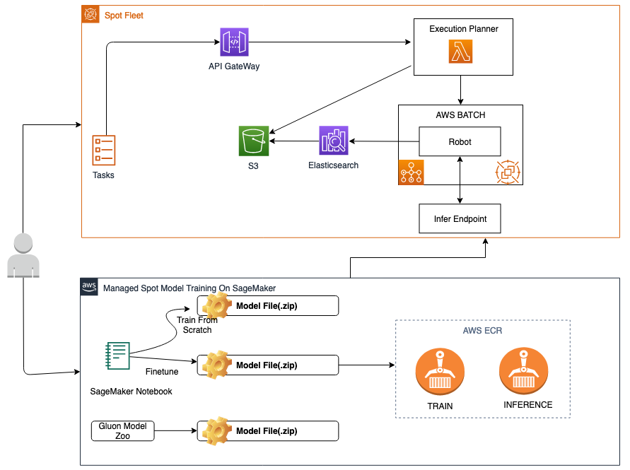

# Spot Tagging Bot for Digital Assets

[中文版本](./README.md)

Spot Tagging Bot for Digital Assets is an open source solution. This solution includes several digital asset knowledge labeling software robots.With these robots, users can knowingly label digital assets (forms, pictures, PDFs, videos, crawlers and other rich text information) stored in AWS S3.These knowledge labels extract information from inside digital assets into labels that can be further processed.For example, extracting information such as names, addresses, etc., from ID images; extracting conversation captions from video conversations; extracting key instruction words from customer service recordings; extracting spending amounts from form data such as invoices, company topics; what time period people who draw specific roles from videos appear at, etc.Users can use this information to build their own knowledge base and further work on process automation and business forecasting.

- **Applicable regions:** cn-northwest-1 (Ningxia), cn-north-1 (Beijing)
- **Version:** v1.0
- **Estimated deployment time:** 20min

If you have problems during your deployment, you can contact us at [GitHub Issues](https://github.com/aws-samples/spot-tag-bot-for-digital-assets/issues).

## Architecture

You can choose to deploy the Spot Tagging Bot solution directly. Here are the architecture diagram.

## Step 1: Start the CloudFormation stack

The AWS CloudFormation template deploys Spot Tagging Bot for Digital Assets solution on AWS Cloud.

You are responsible for the cost of the AWS services when running this solution. For more details, please see the pricing page for each AWS service that will be used in this solution.

1. Log in to the AWS Management Console and click the button below to start the AWS CloudFormation template.

 
 
2. By default, the template is launched in the AWS Ningxia region. To launch the solution in another AWS region, use the zone selector in the console navigation bar.

3. On the **Create Stack** page, confirm that the correct template URL is displayed in the **Amazon S3 URL** text box and select **Next**.

4. On the **Specify Stack Details** page, assign a name to the solution stack.

5. Under **Parament**, check the parameters of the template and modify as needed.

2. Choose **Next Step**.

3. On the **Configure Stack Options** page, select Next.

4. On the **Audit** page, review and confirm the settings. Ensure that the confirmation template will create the AWS Identity and Access Management (IAM) resource box is selected.

5. Select **Create Stack** to deploy the stack.

You can view the status of the stack in the **Status** column of the AWS CloudFormation Console. You should see the status CREATE_Complete in about 20 minutes.

## FAQ

**Q: How does the Spot Tagging Bot solution work?**

The Spot Tagging Bot for Digital Assets solution includes an AWS CloudFormation template to help you deploy quickly in your AWS account. This template initiates all the resources and create permissions you need to deploy this solution.
When the template is deployed, you can specify the S3 path of the data assets and the robot you need to start. Spot Tagging Bot for Digital Assets solution supports many data asset types, including text, video, pictures, etc. After launch, the specified robot generates a list of tasks based on the content of the current S3, which contains digital assets to be processed, such as 1,000 videos that need to be labeled. Specific tasks are segmented (Batch), and then multiple instances of robots handle their respective task segments, if there are a total of 10 robots, each batch may include 100 videos. These robot instances are all running on Spot Instances to lower the price. After processed current task, the robot writes the results to Elastic Search and S3. If any exception occurs to a robot instance, the task is given to another robot instance to redo it. Customers can query the results of a task through Elastic Search and understand the execution status of the entire task.

**Q: Can I use my own data to fine tune?**

Yes, there is a container-based training framework in the Spot Tagging Bot for Digital Assets solution. User can use AWS Sagemaker or other Notebook hosting services to open training framework software and import their own labeled data for training. After training, user can export result into the framework. Spot Tagging Bot for Digital Assets solution will use the fine-tune model for inference.
